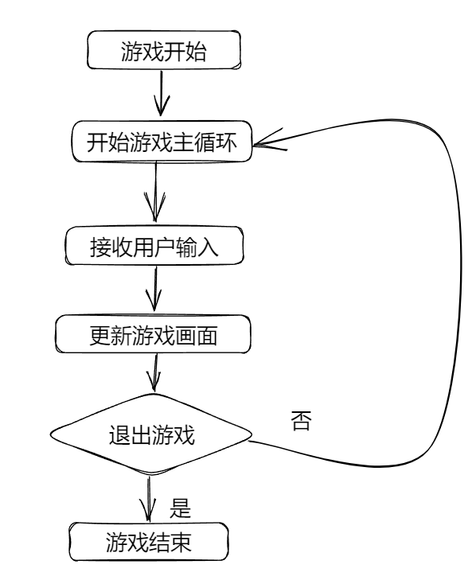
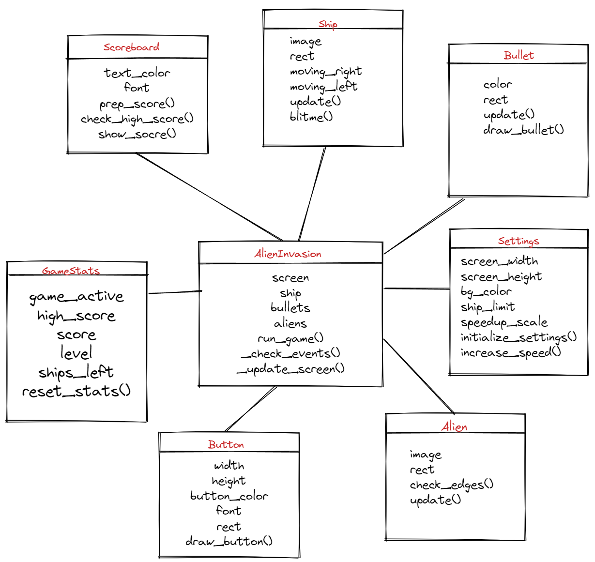
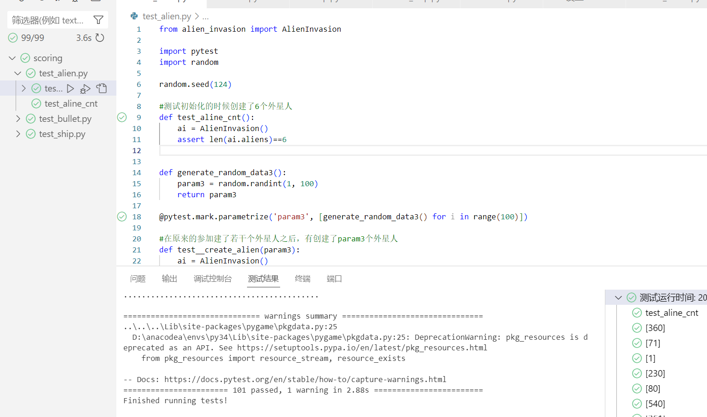
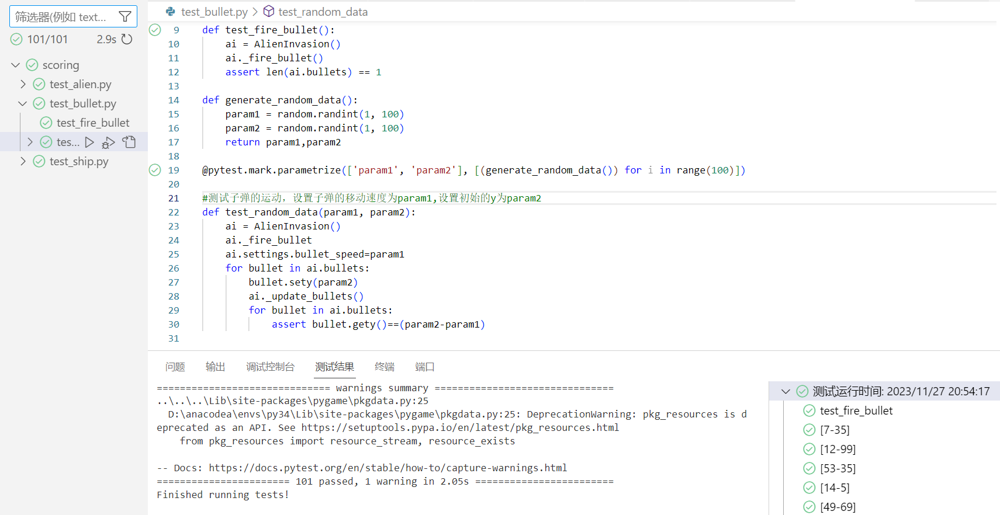
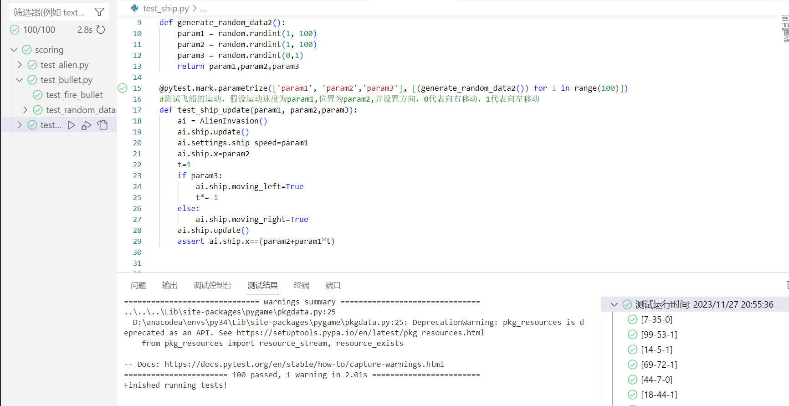

# 《Python程序设计基础》程序设计作品说明书

题目： 你选择的项目题目

学院： 21计科01

姓名： 刘湘怡

学号： B20210302110

指导教师： 周景

起止日期：2023.11.10-2023.12.10

## 摘要

_介绍本次设计完成的项目的概述，本文的主要内容，总结你主要完成的工作以及关键词。_

关键词：

## 第1章 需求分析

_本章的内容主要包括系统的需求分析，系统主要需要实现的功能有哪些，可以帮助用户解决哪些问题等等。_

需求分析：实现一个外星人大战的小游戏，玩家通过电脑的键盘来控制游戏人物的运动，其中左箭头代表左移，右箭头代表右移，有若干个关卡，每一个关卡都可以发射不同数量的子弹来射击外星飞船，每击中一个外星飞船都会获得相应的分数，但是如果外星飞船到达了游戏的底部，那么游戏减少血量，血量有限，游戏界面会显示正在游戏的关卡，本轮游戏的分数还有目前已知最高分。

游戏的主要功能是游戏的正常运行，外星人，游戏人物，子弹的运动，还有背景音乐的释放，背景的显示，保存分数，游戏界面显示的各种信息。

## 第2章 分析与设计

_本章的内容主要包括系统的设计，例如：系统架构、系统流程、系统模块、数据库的设计，以及关键的实现，例如：使用的数据结果、算法。_

### 系统流程



### 游戏模块

#### 游戏类

实现游戏界面的正常显示，判断子弹和外星人的碰撞，外星人和墙，飞船，底部的碰撞，还有实时控制游戏的显示，音乐的播放，以及键盘的监听来实现游戏和用户之间的交互。

保存每次游戏完成后的成绩

```python
#保存每次游戏完成后的成绩
 def savescore(self):
    with open('database/score.csv','a',newline='') as f:
         writer = csv.writer(f)
        now=str(self.stats.score)
        writer.writerow([now])
```

游戏运行

```python
#游戏运行
def run_game(self):
     while True:
        self._check_events()
         if self.game_active:
            self.ship.update()
            self._update_bullets()
            self._update_aliens()
        self._update_screen()
        self.music.display()
        self.clock.tick(60)
```

键盘监听

```python
#监听键盘
def _check_events(self):
    for event in pygame.event.get():
        if event.type == pygame.QUIT:#点击了关闭游戏，保存成绩并关掉屏幕
        self.savescore()
        sys.exit()
        elif event.type == pygame.KEYDOWN:
            self._check_keydown_events(event)
        elif event.type == pygame.KEYUP:
            self._check_keyup_events(event)
        elif event.type == pygame.MOUSEBUTTONDOWN:
            mouse_pos = pygame.mouse.get_pos()
            self._check_play_button(mouse_pos)
```

判断是否点击`play`

```python
def _check_play_button(self, mouse_pos):
        """Start a new game when the player clicks Play."""
        button_clicked = self.play_button.rect.collidepoint(mouse_pos)
        #print('2')
        if not self.game_active :
            #print('3')
            self.savescore()
        if button_clicked and not self.game_active:#重新开始游戏，一些数据需要重置，比如外星人和飞船的速度什么的，
            # Reset the game settings.
            self.settings.initialize_dynamic_settings()

            # Reset the game statistics.
            #self.stats.score=0
            #重置分数，关卡，ship_left,以及更新各种需要显示的一些数据，把游戏的状态改变为游戏正在玩的状态
            self.stats.reset_stats()
            self.sb.prep_score()
            self.sb.prep_level()
            self.sb.prep_ships()
            self.game_active = True
            
            # Get rid of any remaining bullets and aliens.
            #释放子弹，外星人的精灵组
            self.bullets.empty()
            self.aliens.empty() 

            # Create a new fleet and center the ship.
            #重新创建外星人群
            self._create_fleet()
            #重新把飞船居中
            self.ship.center_ship()

            # Hide the mouse cursor.
            #鼠标在游戏屏幕可见
            pygame.mouse.set_visible(True)

```

判断键盘是否按下

```python
 #判断键盘是否按下
    def _check_keydown_events(self, event):
        """Respond to keypresses."""
        if event.key == pygame.K_RIGHT:
            self.ship.moving_right = True
        if event.key == pygame.K_LEFT:
            self.ship.moving_left = True
        if event.key == pygame.K_q:
            sys.exit()
        if event.key == pygame.K_SPACE:
            self._fire_bullet()
        if event.key==pygame.K_F1:
            #print("1")
            self.full_screen=not self.full_screen
            #全屏和半屏之间的转化
            if self.full_screen:
                #print('2')
                self.screen=pygame.display.set_mode((self.settings.screen_width, self.settings.screen_height),pygame.FULLSCREEN,32)
            else:
                #print('3')
                self.screen=pygame.display.set_mode((self.settings.screen_width, self.settings.screen_height),0,32)
```

判断键盘的释放

```python
#判断键盘的释放
    def _check_keyup_events(self, event):
        """Respond to key releases."""
        if event.key == pygame.K_RIGHT:
            self.ship.moving_right = False
        elif event.key == pygame.K_LEFT:
            self.ship.moving_left = False
```

发出子弹

```python
 #发出子弹
    def _fire_bullet(self):
        """Create a new bullet and add it to the bullets group."""
        #self.music.bullet_display()
        if len(self.bullets) < self.settings.bullets_allowed:
            new_bullet = Bullet(self)
            self.bullets.add(new_bullet)
            self.now+=1
            self.music.bullet_display()
```

更新子弹的位置

```python
 #更新子弹的位置
    def _update_bullets(self):
        """Update position of bullets and get rid of old bullets."""
        # Update bullet positions.
        self.bullets.update()

        # Get rid of bullets that have disappeared.
        #判断子弹是否达到最上面，如果到达，就移除这颗子弹
        for bullet in self.bullets.copy():
            if bullet.rect.bottom <= 0:
                self.bullets.remove(bullet)

        self._check_bullet_alien_collisions()
```

判断子弹和外星人之间的碰撞

```python
#判断子弹和外星人之间的碰撞
    def _check_bullet_alien_collisions(self):
        """Respond to bullet-alien collisions."""
        # Remove any bullets and aliens that have collided.
        #使用两个精灵组之间的检测碰撞函数，并且两个碰撞的精灵都会消失，都有True
        collisions = pygame.sprite.groupcollide(
                self.bullets, self.aliens, True, True)
       
        #如果发生了碰撞，则播放碰撞的音乐并且加上相应的分数
        if collisions:
            self.music.collsion_display()
            for aliens in collisions.values():
                self.stats.score += self.settings.alien_points * len(aliens)
            self.sb.prep_score()
            self.sb.check_high_score()
        
        #如果所有的外星人都被射击了，那么清空子弹，关卡更新，屏幕上显示的关卡信息也更新
        if not self.aliens:
            # Destroy existing bullets and create new fleet.
            self.bullets.empty()
            self._create_fleet()
            self.settings.increase_speed()

            # Increase level.
            self.stats.level += 1
            self.sb.prep_level()
```

如果外星人已经入侵到需要保护的区域,做出相应回应

```python
 #如果外星人已经入侵到需要保护的区域
    def _ship_hit(self):
        """Respond to the ship being hit by an alien."""
        #如果血量还大于0，血量-1
        if self.stats.ships_left > 0:
            # Decrement ships_left, and update scoreboard.
            self.stats.ships_left -= 1
            self.sb.prep_ships()

            # Get rid of any remaining bullets and aliens.
            #然后重新更新外星人的和子弹
            self.bullets.empty()
            self.aliens.empty()

            # Create a new fleet and center the ship.
            self._create_fleet()
            self.ship.center_ship()

            # Pause.
            sleep(0.5)
        else:
            #表示游戏结束
            self.game_active = False
            pygame.mouse.set_visible(True)
```

外星人运动

```python
def _update_aliens(self):
        """Check if the fleet is at an edge, then update positions."""
        #如果射击外星人的数量等于lim,那么这时候我们需要更新这群外星人的方向
        if self.now==self.lim:
            #print(self.now)
            self._change_fleet_direction()
            self.lim=random.randint(0,self.siz)
            self.now=0
        #判断碰撞到左右边界
        self._check_fleet_edges()
        #更新外星人的位置
        self.aliens.update()

        # Look for alien-ship collisions.
        #判断飞船和外星人之间的碰撞
        if pygame.sprite.spritecollideany(self.ship, self.aliens):
            self._ship_hit()

        # Look for aliens hitting the bottom of the screen.
        self._check_aliens_bottom()
```

判断外星人是否进入保护的区域

```python
 #判断外星人是否进入保护的区域
    def _check_aliens_bottom(self):
        """Check if any aliens have reached the bottom of the screen."""
        for alien in self.aliens.sprites():
            if alien.rect.bottom >= self.settings.screen_height:
                # Treat this the same as if the ship got hit.
                self._ship_hit()
                break

```

创建外星人群

```python
 #创建外星人群
    def _create_fleet(self):
        """Create the fleet of aliens."""
        # Create an alien and keep adding aliens until there's no room left.
        # Spacing between aliens is one alien width and one alien height.
        alien = Alien(self)
        alien_width, alien_height = alien.rect.size

        current_x, current_y = alien_width, alien_height
        #设置了屏幕的限制，每进入一个更后面的关卡，外星人占屏幕就越大，（但是我们也设置了最大的限度） 还有每个外星人之间的间隔
        while (current_y) < (self.settings.maxh*self.settings.screen_height ):
            while (current_x )< (self.settings.maxw*self.settings.screen_width ):
                self._create_alien(current_x, current_y)
                current_x += self.settings.interval * alien_width

            # Finished a row; reset x value, and increment y value.
            current_x = alien_width
            current_y += max(1,(self.settings.interval-0.5)) * alien_height
```

生成一个外星人

```python
 #生成一个外星人
    def _create_alien(self, x_position, y_position):
        """Create an alien and place it in the fleet."""
        new_alien = Alien(self)
        new_alien.x = x_position
        new_alien.rect.x = x_position
        new_alien.rect.y = y_position
        self.aliens.add(new_alien)
        self.cnt+=1
```

判断外星人到达左右边界

```python
 #判断外星人到达左右边界
    def _check_fleet_edges(self):
        """Respond appropriately if any aliens have reached an edge."""
        for alien in self.aliens.sprites():
            if alien.check_edges():
                self._change_fleet_direction()
                break
```

改变外星人的方向

```python
#改变外星人的方向
    def _change_fleet_direction(self):
        """Drop the entire fleet and change the fleet's direction."""
        for alien in self.aliens.sprites():
            alien.rect.y += self.settings.fleet_drop_speed
        self.settings.fleet_direction *= -1
```

更新游戏画面

```python
#更新游戏画面
    def _update_screen(self):
        """Update images on the screen, and flip to the new screen."""
        self.screen.fill(self.settings.bg_color)
        for bullet in self.bullets.sprites():
            bullet.draw_bullet()
        self.ship.blitme()
        self.start.blitme()

        self.aliens.draw(self.screen)

        # Draw the score information.
        self.sb.show_score()

        # Draw the play button if the game is inactive.
        #如果游戏结束，那么显示玩游戏的键
        if not self.game_active:
            # print('1')
            # self.savescore()
            self.play_button.draw_button()

        pygame.display.flip()
```

#### 飞船类

实现飞船的左右运动和飞船的显示。

飞船的运动

```python
def update(self):
        """Update the ship's position based on movement flags."""
        #实现飞船的运动，并且保证飞船不会出画面
        if self.moving_right and self.rect.right < self.screen_rect.right:
            self.x += self.settings.ship_speed
        if self.moving_left and self.rect.left > 0:
            self.x -= self.settings.ship_speed
            
        # Update rect object from self.x.
        self.rect.x = self.x
```

设置飞船的初始位置

```python
    def center_ship(self):
        """Center the ship on the screen."""
        self.rect.midbottom = self.screen_rect.midbottom
        self.x = float(self.rect.x)
```

飞船的显示

```python
 #实现飞船的显示
    def blitme(self):
        """Draw the ship at its current location."""
        self.screen.blit(self.image, self.rect)
```

#### 外星人类

实现外星人群的运动和边界的之间的碰撞

判断外星人是否触碰到左右边界

```python
def check_edges(self):
        """Return True if alien is at edge of screen."""
        screen_rect = self.screen.get_rect()
        return (self.rect.right >= screen_rect.right) or (self.rect.left <= 0)
```

外星人的运动

```python
def update(self):
        """Move the alien right or left."""
        self.x += self.settings.alien_speed * self.settings.fleet_direction
        self.rect.x = self.x
```

外星人的显示
直接调用函数`aliens.draw(self.screen)`

#### 子弹类

实现子弹的运动和显示。

子弹的运动

```python
def update(self):
        """Move the bullet up the screen."""
        # Update the exact position of the bullet.
        self.y -= self.settings.bullet_speed
        # Update the rect position.
        self.rect.y = self.y
```

子弹的显示

```python
 #让子弹在屏幕上显示
    def draw_bullet(self):
        """Draw the bullet to the screen."""
        pygame.draw.circle(self.screen, self.color, (self.x,self.y), self.settings.bullet_r) 
```

#### 星星类

实现在背景上的星星的随机生成，以及实现星星在游戏里面的闪烁（运动）。

随机生成星星

```python
def update(self):
        #print('update')
        for i in range(0,30):
            self.xx.append(random.randint(0,self.screen_width))
            self.yy.append(random.randint(0,self.screen_height))
            t=random.randint(0,len(self.dx)-1)
            self.d.append(t)
```

星星的"闪烁"

```python
 #实现星星的运动
    def move(self):
        #print(len(self.xx))
        if len(self.xx)==0:
            self.update()
        for i in range(len(self.xx)):
            self.xx[i]+=self.speed*self.dx[self.d[i]]
            self.yy[i]+=self.speed*self.dy[self.d[i]]
            #print(self.d[i])
            if self.xx[i]>self.screen_width or self.xx[i]<0:
                self.xx[i]=random.randint(0,self.screen_width)
                self.yy[i]=random.randint(0,self.screen_height)
            elif self.yy[i]>self.screen_height or self.yy[i]<0:
                self.xx[i]=random.randint(0,self.screen_width)
                self.yy[i]=random.randint(0,self.screen_height)
        if self.dis==0:
            for i in range(len(self.d)):
                t=random.randint(0,len(self.dx)-1)
                self.d[i]=t
            self.dis=self.lim
        else:
            self.dis-=1
```

星星的显示

```python
def blitme(self):
        self.move()
        #print('1')
        #self.screen.blit(self.image, self.rect)
        for i in range(len(self.xx)):
            #print(i)
            t=i%(len(self.images))
            self.screen.blit(self.images[t], (self.xx[i],self.yy[i]))
```

#### 音乐类

实现在相应场景播放相应的音乐。

背景音乐的播放

```python
#背景音乐的播放
    def display(self):  
        #self.start_music()   
        if not pygame.mixer.music.get_busy():
            pygame.mixer.music.play(loops=0,start=0)
```

子弹生产的音效

```python
 #子弹生产的音效
    def bullet_display(self):
        p=pygame.mixer.Sound('music/get.mp3')
        p.play()
```

爆炸的音效

```python
 #爆炸的音效
    def collsion_display(self):
        p=pygame.mixer.Sound('music/colles.mp3')
        p.play()
```

#### 按钮类

实现在游戏中显示的信息的正常更新，以及重玩游戏'play'键的正常显示，还有在游戏右上方的分数信息和关卡信息的正常显示。

按钮信息的更新

```python
def _prep_msg(self, msg):
        """Turn msg into a rendered image and center text on the button."""
        self.msg_image = self.font.render(msg, True, self.text_color,
                self.button_color)
        self.msg_image_rect = self.msg_image.get_rect()
        self.msg_image_rect.center = self.rect.center
```

按钮的显示

```python
def draw_button(self):
        """Draw blank button and then draw message."""
        self.screen.fill(self.button_color, self.rect)
        self.screen.blit(self.msg_image, self.msg_image_rect)
```

#### 游戏设置类

主要是游戏的设置，如每个关卡射击一个外星人可以获得多少分数，飞船、子弹，外星人的运动速度，最多可发出的子弹数量，外星人之间的间隔。

初始化动态设置

```python
def initialize_dynamic_settings(self):#初始化动态信息
        """Initialize settings that change throughout the game."""
        self.ship_speed = 1.5
        self.bullet_speed = 2
        self.alien_speed = 1.0

        # fleet_direction of 1 represents right; -1 represents left.
        self.fleet_direction = 1

        # Scoring settings
        self.alien_points = 10
```

难度升级

```python
def increase_speed(self):#增加速度和子弹的限制，还有外星人在屏幕里面的占比
        """Increase speed settings and alien point values."""
        self.ship_speed *= self.speedup_scale
        self.ship_speed=min(self.ship_speed,self.sepeed_limit)
        self.bullet_speed *= self.speedup_scale
        self.bullet_speed=min(self.bullet_speed,self.sepeed_limit)
        self.alien_speed *= self.speedup_scale
        self.alien_speed=min(self.alien_speed,self.sepeed_limit)
        self.interval-=self.decase
        self.interval=max(self.interval,self.interval_limit)
        self.maxh+=0.05
        self.maxh=min(self.maxh,self.limh)
        self.maxw+=0.05
        self.maxw=min(self.maxw,self.limw)
        
        if (self.bullets_allowed+self.bullets_add)<=10:
            self.bullets_allowed+=self.bullets_add
        self.alien_points = int(self.alien_points * self.score_scale)
```

#### 游戏状态类

实现游戏是否还在进行，已经正在进行的关卡信息，保证多轮游戏信息的正确。

可以再来一轮游戏,重置信息

```python
def reset_stats(self):
        """Initialize statistics that can change during the game."""
        self.ships_left = self.settings.ship_limit
        self.score = 0
        self.level = 1
```

#### 类图



## 第3章 软件测试

_本章的内容主要包括以类和函数作为单元进行单元测试，编写的对系统的主要功能的测试用例，以及测试用例执行的测试报告。_

### 测试外星人类

测试游戏最开始是否生成12个外星人

```python
def test_aline_cnt():
    ai = AlienInvasion()
    assert len(ai.aliens)==6
```

游戏开始后生成任意个外星人,测试外星人数量是否正常

利用`@pytest.mark.parametrize-`和`random`来实现多组参数的生成并用来测试

```python
def generate_random_data3():
    param3 = random.randint(1, 100)
    return param3

@pytest.mark.parametrize('param3', [generate_random_data3() for i in range(100)]) 

#在原来的参加建了若干个外星人之后，有创建了param3个外星人
def test__create_alien(param3):
    ai = AlienInvasion()
    t=len(ai.aliens)
    for i in range(param3):
        ai._create_alien(1,1)
    assert len(ai.aliens)==(t+param3)
```



### 测试子弹类

测试是否生成了一颗子弹

```python
def test_fire_bullet():
    ai = AlienInvasion()
    ai._fire_bullet()
    assert len(ai.bullets) == 1
```

测试子弹的运动，随机获取子弹的位置，子弹的运动速度,并多组数据测试

```python
def generate_random_data():
    param1 = random.randint(1, 100)
    param2 = random.randint(1, 100)
    return param1,param2

@pytest.mark.parametrize(['param1', 'param2'], [(generate_random_data()) for i in range(100)]) 

#测试子弹的运动是否正常，设置子弹的移动速度为param1,设置初始的y为param2
def test_random_data(param1, param2):
    ai = AlienInvasion()
    ai._fire_bullet
    ai.settings.bullet_speed=param1
    for bullet in ai.bullets:
        bullet.sety(param2)
        ai._update_bullets()
        for bullet in ai.bullets:
            assert bullet.gety()==(param2-param1)
```



### 测试飞船类

测试飞船的运动是否正常，随机生成运动速度，飞船初始位置，飞船运动方向，实现多组随机参数测试

```python
def generate_random_data2():
    param1 = random.randint(1, 100)
    param2 = random.randint(1, 100)
    param3 = random.randint(0,1)
    return param1,param2,param3

@pytest.mark.parametrize(['param1', 'param2','param3'], [(generate_random_data2()) for i in range(100)]) 
#测试飞船的运动，假设运动速度为param1,位置为param2,并设置方向，0代表向右移动，1代表向左移动
def test_ship_update(param1, param2,param3):
    ai = AlienInvasion()
    ai.ship.update()
    ai.settings.ship_speed=param1
    ai.ship.x=param2
    t=1
    if param3:
        ai.ship.moving_left=True
        t*=-1
    else:
        ai.ship.moving_right=True
    ai.ship.update()
    assert ai.ship.x==(param2+param1*t)
```



## 结论

_本章的内容主要是对项目的总结，项目主要实现了哪些功能，达到了哪些目标，哪些不足之处，可以如何改进。_

### 开始游戏

玩家在通过点击`play`键进入游戏

玩家按下`F1`键可以实现游戏的全屏和半屏之间的转换

### 飞船（游戏人物）

玩家按住$\leftarrow$ 可以控制游戏人物向左运动

玩家按住$\rightarrow$ 可以控制游戏人物向左运动

玩家按住空格键可以控制游戏人物发射子弹

如果外星人到达底部或者是接触到游戏人物时会减少血量（每轮游戏有三格血量），如果血量全部耗尽，游戏结束

控制游戏人物击中一个外星人，可以获得相应的分数

### 飞船运动

在获得了玩家对于人物运动方向的信息后，人物都会按照关卡的飞船运动速度在该方向进行移动

### 子弹

玩家按住空格键可以控制游戏人物向左运动，但是每一个关卡都会对子弹的数量都会有限制，关卡级别越大，可以射出的子弹数量越多

人物射出子弹，播放出射出的音效

在子弹在射中了外星人时，播放出射中的音效

如果检测到子弹和外星人之间发生了碰撞，那么我会让两个发生碰撞的子弹和外星人消失，并加上击中一个外星人可以获得的分数

### 外星人

游戏初始化的时候会按照关卡设置的间隔和这个外星人矩阵占屏幕的比例生成一个外星人矩阵

这个外星人矩阵的移动方向都是一样的，一般都是左右移动，只有在到达一点的限制时才会改变，或者是在触碰到了左右的墙才会改变方向

外星人也会向下运动，当外星人触碰到墙的时候才会向下运动

当外星人触碰到游戏人物或者是游戏界面底端时，游戏人物会丧失一点血量，如果血量为0，游戏结束

### 关卡

每一个关卡都会设置不同的速度，外星人之间的间隔，以及外星人矩阵的大小，每一个外星人的分值

## 参考文献

李志远. Python游戏编程项目开发实战[M]. 北京: 清华大学出版社, 2023.

