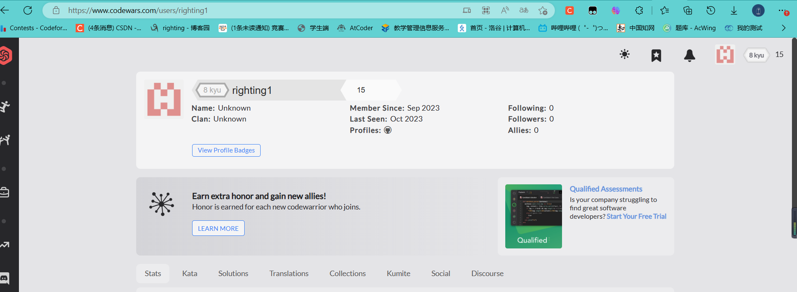
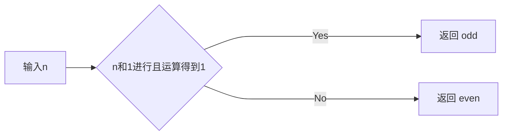

# 实验二 Python变量、简单数据类型

班级： 21计科1班

学号： B20210302110

姓名： 刘湘怡

Github地址：<https://github.com/righting1/python_Experiments>

CodeWars地址：<https://www.codewars.com/users/righting1>

---

## 实验目的

1. 使用VSCode编写和运行Python程序
2. 学习Python变量和简单数据类型

## 实验环境

1. Git
2. Python 3.10
3. VSCode
4. VSCode插件

## 实验内容和步骤

### 第一部分

实验环境的安装

1. 安装Python，从Python官网下载Python 3.10安装包，下载后直接点击可以安装：[Python官网地址](https://www.python.org/downloads/)
2. 为了在VSCode集成环境下编写和运行Python程序，安装下列VScode插件
   - Python
   - Python Environment Manager
   - Python Indent
   - Python Extended
   - Python Docstring Generator
   - Jupyter
   - indent-rainbow
   - Jinja

---

### 第二部分

Python变量、简单数据类型和列表简介

完成教材《Python编程从入门到实践》下列章节的练习：

- 第2章 变量和简单数据类型

---

### 第三部分

在[Codewars网站](https://www.codewars.com)注册账号，完成下列Kata挑战：



[kate账号链接](https://www.codewars.com/users/righting1)

---

#### 第1题：求离整数n最近的平方数（Find Nearest square number）

难度：8kyu

你的任务是找到一个正整数n的最近的平方数
例如，如果n=111，那么nearest_sq(n)（nearestSq(n)）等于121，因为111比100（10的平方）更接近121（11的平方）。
如果n已经是完全平方（例如n=144，n=81，等等），你需要直接返回n。
代码提交地址
<https://www.codewars.com/kata/5a805d8cafa10f8b930005ba>


```python
def nearest_sq(n):
    # pass
    x=int(n**0.5)
    if x*x==n:
        return n
    y=x+1
    xx=abs(x*x-n)
    yy=abs(y*y-n)
    if xx<=yy:
        return x*x
    else :
        return y*y
```

---

#### 第2题：弹跳的球（Bouncing Balls）

难度：6kyu

一个孩子在一栋高楼的第N层玩球。这层楼离地面的高度h是已知的。他把球从窗口扔出去。球弹了起来,  例如:弹到其高度的三分之二（弹力为0.66）。他的母亲从离地面w米的窗户向外看,母亲会看到球在她的窗前经过多少次（包括球下落和反弹的时候）？

一个有效的实验必须满足三个条件：

- 参数 "h"（米）必须大于0
- 参数 "bounce "必须大于0且小于1
- 参数 “window "必须小于h。

如果以上三个条件都满足，返回一个正整数，否则返回-1。
**注意:只有当反弹球的高度严格大于窗口参数时，才能看到球。**
代码提交地址
<https://www.codewars.com/kata/5544c7a5cb454edb3c000047/train/python>


```python
def bouncing_ball(h, bounce, window):
    #h大于0 ,bounce大于0，小于1 ,window<h
    # your code
    if h<0:
        return -1
    if bounce<=0:
        return -1
    if bounce>=1:
        return -1
    if window>=h:
        return -1
    h=h*bounce
    ans=1
    while window<h:
        ans+=2
        h=h*bounce
    return ans
```

---

#### 第3题： 元音统计(Vowel Count)

难度： 7kyu

返回给定字符串中元音的数量（计数）。对于这个Kata，我们将考虑a、e、i、o、u作为元音（但不包括y）。输入的字符串将只由小写字母和/或空格组成。

代码提交地址：
<https://www.codewars.com/kata/54ff3102c1bad923760001f3>


```python
def get_count(sentence):
    #pass
    ans=0
    for i in sentence:
        if i=='a'or i=='e'or i=='i' or i=='o' or i=='u' :
            ans+=1
    return ans
        
```

---

#### 第4题：偶数或者奇数（Even or Odd）

难度：8kyu

创建一个函数接收一个整数作为参数，当整数为偶数时返回”Even”当整数位奇数时返回”Odd”。
代码提交地址：
<https://www.codewars.com/kata/53da3dbb4a5168369a0000fe>


```python
def even_or_odd(number):
    if number&1==1:
        return "Odd"
    else :
        return "Even"
```

### 第四部分

使用Mermaid绘制程序流程图

安装Mermaid的VSCode插件：

- Markdown Preview Mermaid Support
- Mermaid Markdown Syntax Highlighting

使用Markdown语法绘制Even or Odd的程序绘制程序流程图（至少一个），Markdown代码如下：



查看Mermaid流程图语法-->[点击这里](https://mermaid.js.org/syntax/flowchart.html)

使用Markdown编辑器（例如VScode）编写本次实验的实验报告，包括[实验过程与结果](#实验过程与结果)、[实验考查](#实验考查)和[实验总结](#实验总结)，并将其导出为 **PDF格式** 来提交。

## 实验过程与结果

请将实验过程与结果放在这里，包括：

- [第二部分 Python变量、简单数据类型和列表简介](#第二部分)
- [第三部分 Codewars Kata挑战](#第三部分)
- [第四部分 使用Mermaid绘制程序流程图](#第四部分)

注意代码需要使用markdown的代码块格式化，例如Git命令行语句应该使用下面的格式：

显示效果如下：

```bash
git init
git add .
git status
git commit -m "first commit"
```

如果是Python代码，应该使用下面代码块格式，例如：

显示效果如下：

```python
def add_binary(a,b):
    return bin(a+b)[2:]
```

代码运行结果的文本可以直接粘贴在这里。

**注意：不要使用截图，Markdown文档转换为Pdf格式后，截图可能会无法显示。**

## 实验考查

请使用自己的语言并使用尽量简短代码示例回答下面的问题，这些问题将在实验检查时用于提问和答辩以及实际的操作。

1. Python中的简单数据类型有那些？我们可以对这些数据类型做哪些操作？
Python中的简单数据类型包括整型(int)、浮点型(float)、布尔型(bool)、字符串型(str)和空值(NoneType)。我们可以对这些数据类型进行基本的数学运算、逻辑运算、比较运算、类型转换等操作。

2. 为什么说Python中的变量都是标签？
Python中的变量都是标签，是因为Python中的变量实际上是对象的引用，而不是存储值的容器。当我们创建一个变量并将其赋值给一个对象时，实际上是将该对象的引用存储在变量中。因此，变量只是指向对象的标签，而不是对象本身。

3. 有哪些方法可以提高Python代码的可读性？
提高Python代码的可读性的方法有：使用有意义的变量名和函数名，避免使用单个字符或者无意义的名称； 缩进代码块，使代码结构清晰；使用注释来解释代码的作用和实现方法；避免使用过长的代码行，可以使用括号或者反斜杠来换行；使用空格来分隔运算符和关键字，使代码更易读。

## 实验总结

总结一下这次实验你学习和使用到的知识，例如：编程工具的使用、数据结构、程序语言的语法、算法、编程技巧、编程思想。
我学会了很多的东西，这样算得上是我自己第一次用python来写题，发现同样的问题，可以用很多方法来解决，就是python的语言习惯可能还不适应，我觉得我应该可以的，然后还学习了怎么用markdown来做思维导图.
