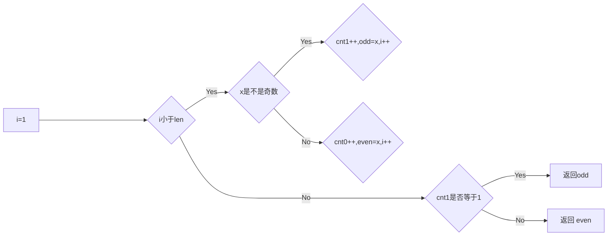
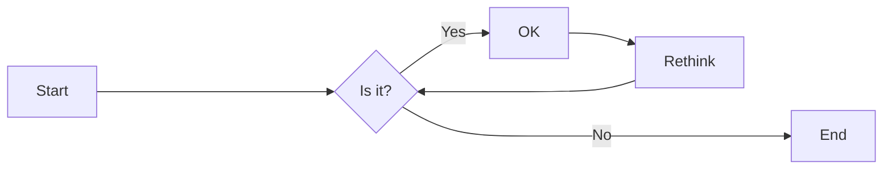

# 实验五 Python数据结构与数据模型

班级： 21计科1

学号： B20210302110

姓名： 刘湘怡

Github地址：<https://github.com/righting1/python_Experiments>

CodeWars地址：<https://www.codewars.com/users/righting1>

---

## 实验目的

1. 学习Python数据结构的高级用法
2. 学习Python的数据模型

## 实验环境

1. Git
2. Python 3.10
3. VSCode
4. VSCode插件

## 实验内容和步骤

### 第一部分

在[Codewars网站](https://www.codewars.com)注册账号，完成下列Kata挑战：

---

#### 第一题：停止逆转我的单词

难度： 6kyu

编写一个函数，接收一个或多个单词的字符串，并返回相同的字符串，但所有5个或更多的字母单词都是相反的（就像这个Kata的名字一样）。传入的字符串将只由字母和空格组成。只有当出现一个以上的单词时，才会包括空格。
例如：

```python
spinWords( "Hey fellow warriors" ) => returns "Hey wollef sroirraw" 
spinWords( "This is a test") => returns "This is a test" 
spinWords( "This is another test" )=> returns "This is rehtona test"
```

代码提交地址：
<https://www.codewars.com/kata/5264d2b162488dc400000001>

提示：

- 利用str的split方法可以将字符串分为单词列表
例如：

```python
words = "hey fellow warrior".split()
# words should be ['hey', 'fellow', 'warrior']
```

- 利用列表推导将长度大于等于5的单词反转(利用切片word[::-1])
- 最后使用str的join方法连结列表中的单词。


```python
def spin_words(sentence):
    # Your code goes here
    #return None
    sentence=sentence.split(" ")
    ans=""
    for word in sentence:
        if len(word)<5:
            ans+=word
            ans+=" "
        else :
            word=word[::-1]
            ans+=word
            ans+=" "
    ans=ans.strip();
    return "".join(ans)
        
```

---

#### 第二题： 发现离群的数(Find The Parity Outlier)

难度：6kyu

给你一个包含整数的数组（其长度至少为3，但可能非常大）。该数组要么完全由奇数组成，要么完全由偶数组成，除了一个整数N。请写一个方法，以该数组为参数，返回这个 "离群 "的N。

例如：

```python
[2, 4, 0, 100, 4, 11, 2602, 36]
# Should return: 11 (the only odd number)

[160, 3, 1719, 19, 11, 13, -21]
# Should return: 160 (the only even number)
```

代码提交地址：
<https://www.codewars.com/kata/5526fc09a1bbd946250002dc>


```python
def find_outlier(integers):
    #return None
    odd=-1
    even=-1
    cnt0=0
    cnt1=0
    for x in integers:
        if x&1==1:
            cnt1+=1
            odd=x
        else :
            cnt0+=1
            even=x
    if cnt1==1:
        return odd
    else :
        return even
```



---

#### 第三题： 检测Pangram

难度：6kyu

pangram是一个至少包含每个字母一次的句子。例如，"The quick brown fox jumps over the lazy dog "这个句子就是一个pangram，因为它至少使用了一次字母A-Z（大小写不相关）。

给定一个字符串，检测它是否是一个pangram。如果是则返回`True`，如果不是则返回`False`。忽略数字和标点符号。
代码提交地址：
<https://www.codewars.com/kata/545cedaa9943f7fe7b000048>


```python
def is_pangram(s):
    #return False
    s=s.lower()
    res="qwertyuiopasdfghjklzxcvbnm"
    for x in res:
        if x not in s:
            return False
    return True
```

---

#### 第四题： 数独解决方案验证

难度：6kyu

数独背景

数独是一种在 9x9 网格上进行的游戏。游戏的目标是用 1 到 9 的数字填充网格的所有单元格，以便每一列、每一行和九个 3x3 子网格（也称为块）中的都包含数字 1 到 9。更多信息请访问：<http://en.wikipedia.org/wiki/Sudoku>

编写一个函数接受一个代表数独板的二维数组，如果它是一个有效的解决方案则返回 true，否则返回 false。数独板的单元格也可能包含 0，这将代表空单元格。包含一个或多个零的棋盘被认为是无效的解决方案。棋盘总是 9 x 9 格，每个格只包含 0 到 9 之间的整数。

代码提交地址：
<https://www.codewars.com/kata/63d1bac72de941033dbf87ae>


```python
def validate_sudoku(board):
    #return True
    res=set(range(1,10))
    for x in board:
        if set(x)!=res:
            return False
    for x in zip(*board):
        if set(x)!=res:
            return False
    for i in range(3,10,3):
        for j in range(3,10,3):
             if res != {(board[q][w]) for w in range(j-3,j)  for q in range(i-3,i)}:
                return False
    return True
            
```

---

#### 第五题： 疯狂的彩色三角形

难度： 2kyu

一个彩色的三角形是由一排颜色组成的，每一排都是红色、绿色或蓝色。连续的几行，每一行都比上一行少一种颜色，是通过考虑前一行中的两个相接触的颜色而产生的。如果这些颜色是相同的，那么新的一行就使用相同的颜色。如果它们不同，则在新的一行中使用缺失的颜色。这个过程一直持续到最后一行，只有一种颜色被生成。

例如：

```python
Colour here:            G G        B G        R G        B R
Becomes colour here:     G          R          B          G
```

一个更大的三角形例子：

```python
R R G B R G B B
 R B R G B R B
  G G B R G G
   G R G B G
    B B R R
     B G R
      R B
       G
```

你将得到三角形的第一行字符串，你的工作是返回最后的颜色，这将出现在最下面一行的字符串。在上面的例子中，你将得到 "RRGBRGBB"，你应该返回 "G"。
限制条件： 1 <= length(row) <= 10 ** 5
输入的字符串将只包含大写字母'B'、'G'或'R'。

例如：

```python
triangle('B') == 'B'
triangle('GB') == 'R'
triangle('RRR') == 'R'
triangle('RGBG') == 'B'
triangle('RBRGBRB') == 'G'
triangle('RBRGBRBGGRRRBGBBBGG') == 'G'
```

代码提交地址：
<https://www.codewars.com/kata/5a331ea7ee1aae8f24000175>

提示：请参考下面的链接，利用三进制的特点来进行计算。
<https://stackoverflow.com/questions/53585022/three-colors-triangles>


```python
def triangle(row):
    #pass
    mp={'GG':'G', 'BB':'B', 'RR':'R', 'BR':'G', 
        'BG':'R', 'GB':'R', 'GR':'B', 'RG':'B', 'RB':'G'}
    res=[3**i+1 for i in range(10)][::-1]
    for x in res:
        while len(row)>=x:
            row=[mp[row[i]+row[i+x-1]]for i in range(len(row)-x+1)]
    return row[0]
```

---

### 第二部分

使用Mermaid绘制程序流程图

安装VSCode插件：

- Markdown Preview Mermaid Support
- Mermaid Markdown Syntax Highlighting

使用Markdown语法绘制你的程序绘制程序流程图（至少一个），Markdown代码如下：

显示效果如下：



查看Mermaid流程图语法-->[点击这里](https://mermaid.js.org/syntax/flowchart.html)

使用Markdown编辑器（例如VScode）编写本次实验的实验报告，包括[实验过程与结果](#实验过程与结果)、[实验考查](#实验考查)和[实验总结](#实验总结)，并将其导出为 **PDF格式** 来提交。

## 实验过程与结果

请将实验过程与结果放在这里，包括：

- [第一部分 Codewars Kata挑战](#第一部分)
- [第二部分 使用Mermaid绘制程序流程图](#第二部分)

注意代码需要使用markdown的代码块格式化，例如Git命令行语句应该使用下面的格式：


显示效果如下：

```bash
git init
git add .
git status
git commit -m "first commit"
```

如果是Python代码，应该使用下面代码块格式，例如：


显示效果如下：

```python
def add_binary(a,b):
    return bin(a+b)[2:]
```

代码运行结果的文本可以直接粘贴在这里。

**注意：不要使用截图，因为Markdown文档转换为Pdf格式后，截图会无法显示。**

## 实验考查

请使用自己的语言并使用尽量简短代码示例回答下面的问题，这些问题将在实验检查时用于提问和答辩以及实际的操作。

1. 集合（set）类型有什么特点？它和列表（list）类型有什么区别？
集合（Set）是一种无序且不重复的数据集合。集合中的元素不能重复，且没有固定的顺序。以下是集合类型的一些特点：

无序性：集合中的元素没有固定的顺序，每次访问元素时，可能得到不同的顺序。
唯一性：集合中的元素不能重复，即每个元素只能出现一次。
简洁性：集合只存储元素的标识，不存储元素本身的内容。
操作快速：集合的操作通常非常快速，如添加、删除和查找元素等。
集合与列表（List）的区别如下：

有序性：列表是有序的，元素在列表中的位置是固定的，可以通过索引访问。而集合是无序的，元素在集合中的顺序是不确定的。
唯一性：列表中的元素可以重复出现多次。而集合中的元素不能重复。
存储内容：列表可以存储复杂的数据类型（如对象），而集合只能存储简单数据类型（如整数、浮点数等）。
操作复杂性：列表的操作通常比集合复杂，因为列表需要考虑更多的细节，如元素的顺序和位置等。
查询效率：集合的查询效率通常比列表高，因为集合中查找元素的时间复杂度是O(1)，而列表中查找元素的时间复杂度是O(n)。
2. 集合（set）类型主要有那些操作？
集合（Set）类型主要有以下几种操作：
并集：将两个集合合并成一个新集合，包含两个集合的所有元素。
交集：求两个集合的交集，包含两个集合中共有的元素。
差集：求两个集合的差集，包含在第一个集合中但不在第二个集合中的元素。
对称差集：求两个集合的对对称差集，包含在第一个集合或第二个集合中但不同时出现在两个集合中的元素。
除此之外，集合还支持添加、删除、查询等基本操作。
3. 使用`*`操作符作用到列表上会产生什么效果？为什么不能使用`*`操作符作用到嵌套的列表上？使用简单的代码示例说明。
在Python中，*操作符在列表上有两种主要的用法。

当*操作符用于扩展列表时，它可以将列表中的元素复制并添加到当前列表的末尾。例如：

```python
list1 = [1, 2, 3]  
list2 = list1 * 2  
print(list2)  # 输出：[1, 2, 3, 1, 2, 3]
```

在这个例子中，list1 * 2创建了一个新的列表，其中包含了list1中的所有元素两次。

当*操作符用于列表切片时，它可以用来获取列表的一部分。例如：

```python
list1 = [1, 2, 3, 4, 5]  
print(list1[::2])  # 输出：[1, 3, 5]
```

在这个例子中，list1[::2]创建了一个新的列表，其中包含了list1中的所有偶数索引元素。
然而，你不能直接将*操作符用于嵌套的列表，因为这会引发语法错误。这是因为*操作符在Python中是用于对单个对象进行操作的，而不是对嵌套的对象进行操作的。如果你想要复制和添加嵌套列表的所有元素，你需要首先将嵌套列表展开。例如：

```python
nested_list = [[1, 2], [3, 4]]  
flat_list = [item for sublist in nested_list for item in sublist]  
print(flat_list)  # 输出：[1, 2, 3, 4]
```

在这个例子中，我们使用了列表解析来遍历嵌套列表中的每个子列表，并将它们的元素添加到一个新的平铺列表中。
4. 总结列表,集合，字典的解析（comprehension）的使用方法。使用简单的代码示例说明。
列表解析（List Comprehension），字典解析（Dictionary Comprehension）和集合解析（Set Comprehension）是 Python 中非常强大的工具，可以简洁高效地生成列表，字典和集合。

1. 列表解析：
列表解析是 Python 中最常用的列表生成方式，它可以非常方便地创建一个列表。基本的语法如下：

```python
[expression for item in list]
```

例如，我们可以使用列表解析来创建一个包含 1 到 10 的平方的列表：

```python
squares = [x**2 for x in range(1, 11)]
print(squares)  # 输出：[1, 4, 9, 16, 25, 36, 49, 64, 81, 100]
```

1. 字典解析：字典解析可以用来创建字典，语法如下：

```python
{expression: value for item in list}
```

例如，我们可以使用字典解析来创建一个字典，其中每个数字作为键，对应的平方作为值：

```python
squares_dict = {x: x**2 for x in range(1, 11)}
print(squares_dict)  # 输出:{1: 1, 2: 4, 3: 9, 4: 16, 5: 25, 6: 36, 7: 49, 8: 64, 9: 81, 10: 100}
```

1. 集合解析：

集合解析可以用来创建集合，语法与列表解析相似，只是结果被一对大括号包围：

```python
{expression for item in list}
```

例如，我们可以使用集合解析来创建一个包含 1 到 10 的所有奇数的集合：

```python
odd_numbers = {x for x in range(1, 11) if x % 2 != 0}
print(odd_numbers)  # 输出：{1, 3, 5, 7, 9}
```

以上就是列表、字典和集合解析的基本使用方法。它们都是 Python 中强大的工具，可以帮助我们更简洁、更高效地生成列表、字典和集合。

## 实验总结

总结一下这次实验你学习和使用到的知识，例如：编程工具的使用、数据结构、程序语言的语法、算法、编程技巧、编程思想。
我熟悉并使用了一些基本的编程工具，如文本编辑器、集成开发环境（IDE）和命令行工具。这些工具帮助我编写、调试和管理代码.
