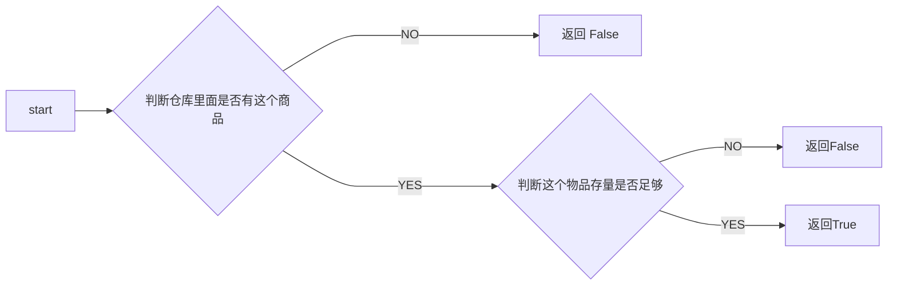
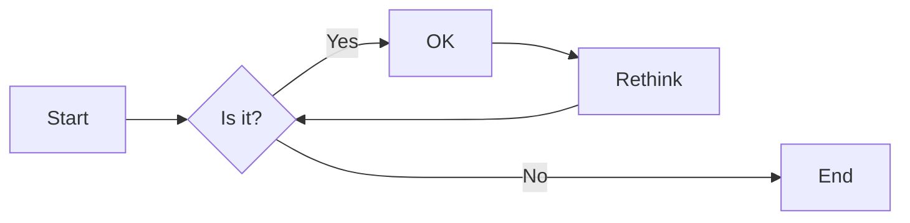

# 实验四 Python字典和while循环

班级： 21计科1

学号： B20210302110

姓名： 刘湘怡

Github地址：<https://github.com/righting1/python_Experiments>

CodeWars地址：<https://www.codewars.com/users/righting1>

---

## 实验目的

1. 学习Python字典
2. 学习Python用户输入和while循环

## 实验环境

1. Git
2. Python 3.10
3. VSCode
4. VSCode插件

## 实验内容和步骤

### 第一部分

Python列表操作

完成教材《Python编程从入门到实践》下列章节的练习：

- 第6章 字典
- 第7章 用户输入和while循环

---

### 第二部分

在[Codewars网站](https://www.codewars.com)注册账号，完成下列Kata挑战：

---

#### 第一题：淘气还是乖孩子（Naughty or Nice）

难度： 7kyu

圣诞老人要来镇上了，他需要你帮助找出谁是淘气的或善良的。你将会得到一整年的JSON数据，按照这个格式：

```python
{
    January: {
        '1': 'Naughty','2': 'Naughty', ..., '31': 'Nice'
    },
    February: {
        '1': 'Nice','2': 'Naughty', ..., '28': 'Nice'
    },
    ...
    December: {
        '1': 'Nice','2': 'Nice', ..., '31': 'Naughty'
    }
}
```

你的函数应该返回 "Naughty!"或 "Nice!"，这取决于在某一年发生的总次数（以较大者为准）。如果两者相等，则返回 "Nice！"。
代码提交地址：
<https://www.codewars.com/kata/5662b14e0a1fb8320a00005c>


```python
def naughty_or_nice(data):
    ans1=0
    ans2=0
    for dic in data.values():
        for x in dic.values():
            if x=='Nice':
                ans1+=1
            else :
                ans2+=1
    if ans1>=ans2:
        return "Nice!"
    return "Naughty!"
```

---

#### 第二题： 观察到的PIN（The observed PIN）

难度：4kyu

好了，侦探，我们的一个同事成功地观察到了我们的目标人物，抢劫犯罗比。我们跟踪他到了一个秘密仓库，我们认为在那里可以找到所有被盗的东西。这个仓库的门被一个电子密码锁所保护。不幸的是，我们的间谍不确定他看到的密码，当罗比进入它时。

键盘的布局如下：

```python
┌───┬───┬───┐
│ 1 │ 2 │ 3 │
├───┼───┼───┤
│ 4 │ 5 │ 6 │
├───┼───┼───┤
│ 7 │ 8 │ 9 │
└───┼───┼───┘
    │ 0 │
    └───┘
```

他注意到密码1357，但他也说，他看到的每个数字都有可能是另一个相邻的数字（水平或垂直，但不是对角线）。例如，代替1的也可能是2或4。而不是5，也可能是2、4、6或8。

他还提到，他知道这种锁。你可以无限制地输入错误的密码，但它们最终不会锁定系统或发出警报。这就是为什么我们可以尝试所有可能的（*）变化。

*可能的意义是：观察到的PIN码本身和考虑到相邻数字的所有变化。

你能帮助我们找到所有这些变化吗？如果有一个函数，能够返回一个列表，其中包含一个长度为1到8位的观察到的PIN的所有变化，那就更好了。我们可以把这个函数命名为getPINs（在python中为get_pins，在C#中为GetPINs）。

但请注意，所有的PINs，包括观察到的PINs和结果，都必须是字符串，因为有可能会有领先的 "0"。我们已经为你准备了一些测试案例。
侦探，我们就靠你了!
代码提交地址：
<https://www.codewars.com/kata/5263c6999e0f40dee200059d>


```python
def get_pins(observed):
    #pass # TODO: This is your job, detective!
    ans=[]
    op={
        '1':['2','4'],
        '2':['1','3','5'],
        '3':['2','6'],
        '4':['1','5','7'],
        '5':['2','4','6','8'],
        '6':['3','5','9'],
        '7':['4','8'],
        '8':['5','7','9','0'],
        '9':['6','8'],
        '0':['8']
    }
    ans.append(observed)
    #ans=set(ans)
    for i in range(len(observed)):
        x=observed[i]
        res=[]
        for y in op[x]:
            for now in ans:
                p=list(now)
                p[i]=y
                res.append(''.join(p))
        ans=ans+res
    ans=set(ans)
    return ans
```

---

#### 第三题： RNA到蛋白质序列的翻译（RNA to Protein Sequence Translation）

难度：6kyu

蛋白质是由DNA转录成RNA，然后转译成蛋白质的中心法则。RNA和DNA一样，是由糖骨架（在这种情况下是核糖）连接在一起的长链核酸。每个由三个碱基组成的片段被称为密码子。称为核糖体的分子机器将RNA密码子转译成氨基酸链，称为多肽链，然后将其折叠成蛋白质。

蛋白质序列可以像DNA和RNA一样很容易地可视化，作为大字符串。重要的是要注意，“停止”密码子不编码特定的氨基酸。它们的唯一功能是停止蛋白质的转译，因此它们不会被纳入多肽链中。“停止”密码子不应出现在最终的蛋白质序列中。为了节省您许多不必要（和乏味）的键入，已为您的氨基酸字典提供了键和值。

给定一个RNA字符串，创建一个将RNA转译为蛋白质序列的函数。注意：测试用例将始终生成有效的字符串。

```python
protein（'UGCGAUGAAUGGGCUCGCUCC'）
```

将返回`CDEWARS`

作为测试用例的一部分是一个真实世界的例子！最后一个示例测试用例对应着一种叫做绿色荧光蛋白的蛋白质，一旦被剪切到另一个生物体的基因组中，像GFP这样的蛋白质可以让生物学家可视化细胞过程！

Amino Acid Dictionary

```python
   # Your dictionary is provided as PROTEIN_DICT
   PROTEIN_DICT = {
    # Phenylalanine
    'UUC': 'F', 'UUU': 'F',
    # Leucine
    'UUA': 'L', 'UUG': 'L', 'CUU': 'L', 'CUC': 'L', 'CUA': 'L', 'CUG': 'L',
    # Isoleucine
    'AUU': 'I', 'AUC': 'I', 'AUA': 'I',
    # Methionine
    'AUG': 'M',
    # Valine
    'GUU': 'V', 'GUC': 'V', 'GUA': 'V', 'GUG': 'V',
    # Serine
    'UCU': 'S', 'UCC': 'S', 'UCA': 'S', 'UCG': 'S', 'AGU': 'S', 'AGC': 'S',
    # Proline
    'CCU': 'P', 'CCC': 'P', 'CCA': 'P', 'CCG': 'P',
    # Threonine
    'ACU': 'T', 'ACC': 'T', 'ACA': 'T', 'ACG': 'T',
    # Alanine
    'GCU': 'A', 'GCC': 'A', 'GCA': 'A', 'GCG': 'A',
    # Tyrosine
    'UAU': 'Y', 'UAC': 'Y',
    # Histidine
    'CAU': 'H', 'CAC': 'H',
    # Glutamine
    'CAA': 'Q', 'CAG': 'Q',
    # Asparagine
    'AAU': 'N', 'AAC': 'N',
    # Lysine
    'AAA': 'K', 'AAG': 'K',
    # Aspartic Acid
    'GAU': 'D', 'GAC': 'D',
    # Glutamic Acid
    'GAA': 'E', 'GAG': 'E',
    # Cystine
    'UGU': 'C', 'UGC': 'C',
    # Tryptophan
    'UGG': 'W',
    # Arginine
    'CGU': 'R', 'CGC': 'R', 'CGA': 'R', 'CGG': 'R', 'AGA': 'R', 'AGG': 'R',
    # Glycine
    'GGU': 'G', 'GGC': 'G', 'GGA': 'G', 'GGG': 'G',
    # Stop codon
    'UAA': 'Stop', 'UGA': 'Stop', 'UAG': 'Stop'
}
```

代码提交地址：
<https://www.codewars.com/kata/555a03f259e2d1788c000077>


```python
def protein(rna):
    # your code here
    # Your dictionary is provided as PROTEIN_DICT
    p = {
    # Phenylalanine
    'UUC': 'F', 'UUU': 'F',
    # Leucine
    'UUA': 'L', 'UUG': 'L', 'CUU': 'L', 'CUC': 'L', 'CUA': 'L', 'CUG': 'L',
    # Isoleucine
    'AUU': 'I', 'AUC': 'I', 'AUA': 'I',
    # Methionine
    'AUG': 'M',
    # Valine
    'GUU': 'V', 'GUC': 'V', 'GUA': 'V', 'GUG': 'V',
    # Serine
    'UCU': 'S', 'UCC': 'S', 'UCA': 'S', 'UCG': 'S', 'AGU': 'S', 'AGC': 'S',
    # Proline
    'CCU': 'P', 'CCC': 'P', 'CCA': 'P', 'CCG': 'P',
    # Threonine
    'ACU': 'T', 'ACC': 'T', 'ACA': 'T', 'ACG': 'T',
    # Alanine
    'GCU': 'A', 'GCC': 'A', 'GCA': 'A', 'GCG': 'A',
    # Tyrosine
    'UAU': 'Y', 'UAC': 'Y',
    # Histidine
    'CAU': 'H', 'CAC': 'H',
    # Glutamine
    'CAA': 'Q', 'CAG': 'Q',
    # Asparagine
    'AAU': 'N', 'AAC': 'N',
    # Lysine
    'AAA': 'K', 'AAG': 'K',
    # Aspartic Acid
    'GAU': 'D', 'GAC': 'D',
    # Glutamic Acid
    'GAA': 'E', 'GAG': 'E',
    # Cystine
    'UGU': 'C', 'UGC': 'C',
    # Tryptophan
    'UGG': 'W',
    # Arginine
    'CGU': 'R', 'CGC': 'R', 'CGA': 'R', 'CGG': 'R', 'AGA': 'R', 'AGG': 'R',
    # Glycine
    'GGU': 'G', 'GGC': 'G', 'GGA': 'G', 'GGG': 'G',
    # Stop codon
    'UAA': 'Stop', 'UGA': 'Stop', 'UAG': 'Stop'
     }
    ans=[]
    for i in range(0,len(rna),3):
        x=rna[i:i+3]
        y=p[x]
        if y=='Stop':
            return ''.join(ans)
        ans.append(y)
    return ''.join(ans)
```

---

#### 第四题： 填写订单（Thinkful - Dictionary drills: Order filler）

难度：8kyu

您正在经营一家在线业务，您的一天中很大一部分时间都在处理订单。随着您的销量增加，这项工作占用了更多的时间，不幸的是最近您遇到了一个情况，您接受了一个订单，但无法履行。

您决定写一个名为`fillable()`的函数，它接受三个参数：一个表示您库存的字典`stock`，一个表示客户想要购买的商品的字符串`merch`，以及一个表示他们想购买的商品数量的整数n。如果您有足够的商品库存来完成销售，则函数应返回`True`，否则应返回`False`。

有效的数据将始终被传入，并且n将始终大于等于1。

代码提交地址：
<https://www.codewars.com/kata/586ee462d0982081bf001f07/python>


```python
def fillable(stock, merch, n):
    # Your code goes here.
    if merch not in stock:
        return False
    if stock[merch]>=n:
        return True
    else :
        return False
```



---

#### 第五题： 莫尔斯码解码器（Decode the Morse code, advanced）

难度： 4kyu

在这个作业中，你需要为有线电报编写一个莫尔斯码解码器。
有线电报通过一个有按键的双线路运行，当按下按键时，会连接线路，可以在远程站点上检测到。莫尔斯码将每个字符的传输编码为"点"（按下按键的短按）和"划"（按下按键的长按）的序列。

在传输莫尔斯码时，国际标准规定：

- "点" - 1个时间单位长。
- "划" - 3个时间单位长。
- 字符内点和划之间的暂停 - 1个时间单位长。
- 单词内字符之间的暂停 - 3个时间单位长。
- 单词间的暂停 - 7个时间单位长。

但是，该标准没有规定"时间单位"有多长。实际上，不同的操作员会以不同的速度进行传输。一个业余人士可能需要几秒钟才能传输一个字符，一位熟练的专业人士可以每分钟传输60个单词，而机器人发射器可能会快得多。

在这个作业中，我们假设消息的接收是由硬件自动执行的，硬件会定期检查线路，如果线路连接（远程站点的按键按下），则记录为1，如果线路未连接（远程按键弹起），则记录为0。消息完全接收后，它会以一个只包含0和1的字符串的形式传递给你进行解码。

例如，消息`HEYJUDE`，即`·····−·−−··−−−··−−··`可以如下接收：

```python
1100110011001100000011000000111111001100111111001111110000000000000011001111110011111100111111000000110011001111110000001111110011001100000011
```

如您所见，根据标准，这个传输完全准确，硬件每个"点"采样了两次。

因此，你的任务是实现两个函数：

函数decodeBits(bits)，应该找出消息的传输速率，正确解码消息为点（.）、划（-）和空格（字符之间有一个空格，单词之间有三个空格），并将它们作为一个字符串返回。请注意，在消息的开头和结尾可能会出现一些额外的0，确保忽略它们。另外，如果你无法分辨特定的1序列是点还是划，请假设它是一个点。

函数decodeMorse(morseCode)，它将接收上一个函数的输出，并返回一个可读的字符串。

注意：出于编码目的，你必须使用ASCII字符.和-，而不是Unicode字符。

莫尔斯码表已经预加载给你了（请查看解决方案设置，以获取在你的语言中使用它的标识符）。

```python
morseCodes(".--")  #to access the morse translation of ".--"
```

下面是Morse码支持的完整字符列表：

```javascript
A    ·–
B    –···
C    –·–·
D    –··
E    ·
F    ··–·
G    ––·
H    ····
I    ··
J    ·–––
K    –·–
L    ·–··
M    ––
N    –·
O    –––
P    ·––·
Q    ––·–
R    ·–·
S    ···
T    –
U    ··–
V    ···–
W    ·––
X    –··–
Y    –·––
Z    ––··
0    –––––
1    ·––––
2    ··–––
3    ···––
4    ····–
5    ·····
6    –····
7    ––···
8    –––··
9    ––––·
.    ·–·–·–
,    ––··––
?    ··––··
'    ·––––·
!    –·–·––
/    –··–·
(    –·––·
)    –·––·–
&    ·–···
:    –––···
;    –·–·–·
=    –···–
+    ·–·–·
-    –····–
_    ··––·–
"    ·–··–·
$    ···–··–
@    ·––·–·
```

代码提交地址：
<https://www.codewars.com/kata/decode-the-morse-code-advanced>


```python
def decode_bits(bits):
    # ToDo: Accept 0's and 1's, return dots, dashes and spaces
    #return bits.replace('111', '-').replace('000', ' ').replace('1', '.').replace('0', '')
    bits=bits.strip('0')
    unit=0
    for x in bits:
        if x!='0':
            unit+=1
        else:
            break
    count=1
    for i in range(1,len(bits)):
        if bits[i]==bits[i-1]:
            count+=1
        else:
            if count<unit:
                unit=count
                count=1
            else:
                count=1
    res=""
    words=bits.split("0"*7*unit)
    for word in words:
        chs=word.split("0"*3*unit)
        for ch in chs:
            signs=ch.split("0"*unit)
            for sign in signs:
                if sign=="1"*3*unit:
                    res+="-"
                else:
                    res+="."
            res+=" "
        res+=" "
    return res
            
        

def decode_morse(morseCode):
    # ToDo: Accept dots, dashes and spaces, return human-readable message
    #return morseCode.replace('.', MORSE_CODE['.']).replace('-', MORSE_CODE['-']).replace(' ', '')
    morseCode=morseCode.strip()
    ans=""
    s= morseCode.split(" ")
    for x in s:
        if x!="":
            ans+=MORSE_CODE[x]
        else:
            ans+=" "
    return "".join(ans)
    

```

---

### 第三部分

使用Mermaid绘制程序流程图

安装VSCode插件：

- Markdown Preview Mermaid Support
- Mermaid Markdown Syntax Highlighting

使用Markdown语法绘制你的程序绘制程序流程图（至少一个），Markdown代码如下：

显示效果如下：



查看Mermaid流程图语法-->[点击这里](https://mermaid.js.org/syntax/flowchart.html)

使用Markdown编辑器（例如VScode）编写本次实验的实验报告，包括[实验过程与结果](#实验过程与结果)、[实验考查](#实验考查)和[实验总结](#实验总结)，并将其导出为 **PDF格式** 来提交。

## 实验过程与结果

请将实验过程与结果放在这里，包括：

- [第一部分 Python列表操作和if语句](#第一部分)
- [第二部分 Codewars Kata挑战](#第二部分)
- [第三部分 使用Mermaid绘制程序流程图](#第三部分)

注意代码需要使用markdown的代码块格式化，例如Git命令行语句应该使用下面的格式：


显示效果如下：

```bash
git init
git add .
git status
git commit -m "first commit"
```

显示效果如下：

```python
def add_binary(a,b):
    return bin(a+b)[2:]
```

代码运行结果的文本可以直接粘贴在这里。

**注意：不要使用截图，Markdown文档转换为Pdf格式后，截图可能会无法显示。**

## 实验考查

请使用自己的语言并使用尽量简短代码示例回答下面的问题，这些问题将在实验检查时用于提问和答辩以及实际的操作。

1. 字典的键和值有什么区别？
字典是一种数据结构，它由一系列键值对组成。每个键都与一个值相关联，可以通过键来访问和获取相应的值。

键和值在字典中的主要区别如下：

1. 存取方式：在字典中，键是用来存取值的，通过键可以找到与其对应的值。而值则无法用来存取键。
2. 唯一性：在字典中，每个键必须是唯一的，而值可以是重复的。这意味着每个键只能对应一个值，但一个值可以对应多个键。
3. 数据类型：键必须是不可变对象，例如字符串、数字或元组。这是因为字典中的键必须能够被哈希，以便通过哈希函数计算出键的存储位置。而值可以是不可变对象或可变对象。
4. 定义方式：字典的定义方式是在一对花括号（{}）之间添加0个或多个元素，元素之间用逗号分隔；每个元素由键和值组成，键与值之间用冒号分隔。

总之，字典中的键和值是相互关联的，通过键可以找到对应的值，但无法通过值找到对应的键。同时，键是唯一的且必须是不可变对象，而值则没有这些限制。
2. 在读取和写入字典时，需要使用默认值可以使用什么方法？
在Python中，字典的默认值可以通过两种方式来设置：

1. 使用内置函数`dict()`来创建一个字典，并在其中使用`defaultdict`作为参数来指定默认值。例如：

```python
from collections import defaultdict

# 创建一个默认值为0的字典
dic = defaultdict(int)
dic["a"] = 1
dic["b"] = 2
dic["c"] = 3
dic["d"] = 4
print(dic["e"])  # 输出0，因为"e"不在字典中，所以使用默认值0
```

 使用字典的`get()`方法来获取一个键的值，并指定一个默认值。如果字典中不存在该键，则返回默认值。例如：

```python
dic = {"a": 1, "b": 2, "c": 3, "d": 4}
key = "e"
value = dic.get(key, 0)  # 如果"e"不在字典中，返回默认值0
print(value)  # 输出0
```

这两种方法都可以在读取和写入字典时使用默认值。
3. Python中的while循环和for循环有什么区别？
在Python中，`while`循环和`for`循环都是常用的循环结构，它们在很多情况下都可以互相替代，但它们之间还是存在一些主要的区别。

1. **执行方式**：`while`循环是当给定的条件为真时反复执行语句块，而`for`循环则是反复执行语句块，直到完成序列中所有项目的迭代。
2. **适用场景**：`while`循环适用于当你知道循环应该持续多久（即当循环次数取决于某个条件时），而`for`循环则适用于当你知道循环应该处理多少个项目（例如遍历一个列表或字典）。
3. **性能**：一般来说，`for`循环比`while`循环更高效，因为它不需要在每次迭代时都重新评估条件。
4. **代码可读性**：在遍历序列（如列表或字典）时，使用`for`循环比使用`while`循环更常见，也更具有可读性。

下面是一些具体的例子来展示这两种循环的区别：

使用`while`循环的例子：

```python
counter = 0
while counter < 5:
    print(counter)
    counter += 1
```

这个例子中，只要`counter`小于5，就会一直打印`counter`的值并递增它。

使用`for`循环的例子：

```python
fruits = ["apple", "banana", "cherry"]
for fruit in fruits:
    print(fruit)
```

这个例子中，我们遍历了列表`fruits`中的每个元素（即每个水果），并打印出它们。
4. 阅读[PEP 636 – Structural Pattern Matching: Tutorial](https://peps.python.org/pep-0636/), 总结Python 3.10中新出现的match语句的使用方法。

## 实验总结

总结一下这次实验你学习和使用到的知识，例如：编程工具的使用、数据结构、程序语言的语法、算法、编程技巧、编程思想。

这次实验收获了很多的东西，学习了很多，每次做题解完之后发现还有更好的解法。
